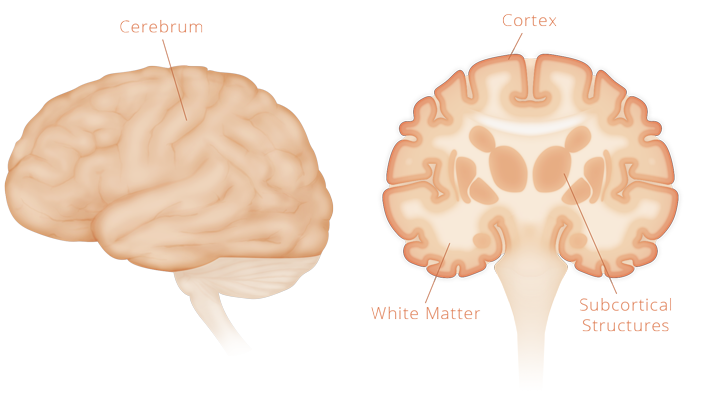

# Structure Of The Cortex

A great deal of the functionality of the cortex comes from its anatomy. Neurons, dendrites, axions and synapses are just the components in which the cortical circuits are constructed. As you'll soon see - no particular neuron has any particular function - its the collective neural anatomy that decribes the collective function. Lets start from the highest level of structure and work our way down.

## Cerebrum

The cerebrum is the largest and upper-most part of the brain. It consists of two hemispheres - the left and the right. Each hemisphere has three main structures: the cortex, subcortex, and the white matter inbetween.

### Cortex

The cortex is the outer layer of the cerebrum. It is a thin sheet of grey matter measuring about 2-4mm thick with an area 1 meter squared. The sheet is structured in six horizontal layers mostly made up of the cell bodies of neurons - giving it a grey-looking color, which is why its called grey matter. HTM theory is oriented around the cortex (specifically the neocortex). We'll go into much more detail later.

### White Matter

Just below the grey matter of the cortex is white matter. It is a vast connection space of myelanated axons origionating from the neurons in the cortex. The axons connect to other parts of the cortex or to other parts of the subcortex. Its called white matter because myelin is made up of fat which is white, unlike the grey of neuron cell bodies. The most important part of the connection infastructure of white matter is the corpus colossum. It is a thick bundle of fibres connecting the two hemispheres together.

### Subcortex

Also known as subcortical structures are the structures that reside beheith the white matter. The most important of them are the thalamus, hippocampus, amygdala and the basal ganglia. Although these structures are not important for learning about HTM, it might be useful to note that the hippocampus is a part of the cerebral cortex, so it is also a part of the cortex too.

## Cerebral Cortex

The cortex has evolved as two structures: the allocortex and neocortex. While the neocortex has six layers of grey matter the allocortex has three. The allocortex is much older than the neocortex (neo - meaning "new") and is believed to be the root from which the neocortex evolved. More specifically the hippocampus (a part of the allocortex) is believed to be where the neocortex "grew" from.

Only mammals posses a neocortex. Primative mammals have a relatively small neocortex while more advanced mammals such as humans have a much larger neocortex compared to the allocortex. Of the 100 billion neurons in the human cortex, 10% are in the allocortex while the other 90% are in the neocortex. It is believed humans are more advanced simply because we have the largest neocortex of all the mammals.

Note: because the majority of the cortex is the neocortex, when someone speaks of the cerebral cortex they are generally referring to the neocortex.

## Neocortex

What we consider to be human intelligence comes from the neocortex. For that reason HTM theory is about modelling the operating principles of the neocortex. This starts by understanding its structure.

When learning about the structure of the neocortex one might find the four lobes: frontal, parietal, occipital and temporal. These names come from the names of the bones that overlay them. Although these names were just used for anatomical classification, there is actually some correlation to functionality too. The temporal, occipital and parietal lobes are mostly involved in processing sensory data, motor commands and memory. The largest lobe, the frontal lobe process more abstract tasks such as cognition, emotional control, planning, along with personality and social behavior.

## Cortical Regions

Within these lobes there are regions that have more specific functions. As an example - the occipital lobe processes visual information, which involves mostly two important cortical regions: the Primary Visual Cortex and the Visual Association Area. Most cortical regions are either processing sensory or motor information directly (i.e Visual Cortex), or they process it indirectly (i.e Visual Association Area). Indirect processing of sensory or motor information happens in associations areas where the input could come from one or more different cortical regions. They essentially integrate information from different regions.

Although regions seems to perform radically different functions, under the hood they all generally function the same way. The difference between them is what input is fed into the region. Essentially a region is shaped by the information flowing into it. This flexible and adaptable functionality of the cortex is at the core of HTM.

The reason the cortex is so flexible in this way is because the brain needed to adapt to the continous morphological changes during evolution. Instead of particular sense having ad-hoc neural implimentation, the brain adopted a broad and adaptable stretegy to process any sensory input, regardless of what it is. As we'll see later, the cortex doesn't actually 'know' anything about the sensory organ that the information is comming from, it only knows about the patterns that are being fed in.

### Association Areas

The human cortex is dominated by cortical regions called association areas. The size of all association areas in the brain correlate to the complexity of behavior and cognition in mammals. Each sensory cortical region sends its information to its own association area. These sensory association areas have simple inputs. For example, the Visual Association Area receives simple details such as edges and corners from the Visual Cortex. These individual details alone mean nothing, but as the association area integrates this information these simple edges and corners come together to form larger details such as textures, curves, shape, etc. Then those details integrate to form higher-level details such as eyes, wheels, leafs, etc. then again to form faces, cars and trees. This process occurs in upwards within a hierarchical structure.

## The Neocortical Hierarchy

Cortical regions are organized as a distributed network connected by the underlaying white matter. The organizing principle of the network is a hierarchy. The hierarchy can be generalized into three catigories: Primary Sensory Areas, Sensory Association Areas, and Higher-Order Association Areas. As we've seen so far the sensory areas feed information to the association areas then higher-order association areas recieve information from many multiple areas, so they have no particular association with any one sense. The prefrontal cortex is a complex structure of just higher-order association areas. Cognition, personality, planning, etc. are all higher-order functions. The prefrontal cortex is high up in the hierarchy, whereas the primary sensory areas are at the bottom.

The flow of information in the hierarchy moves up and down similtanously. The flow upwards is called 'feedforward' while the flow downwards is 'feedback'. This interaction between feedforward and feedback will be discussed later on. For now we'll go a bit deeper into the structure of the cortex.

## Neocortical Columns

The neocortex is organized into a consistent structure of columns. These columns are highly inter-connected neuronal structures that stem from white matter and typically stack vertically. There are no clear boundaries that define a column, because over 90% of the outgoing and incomming axions are to other columns. The neurons in a column work together as a group to represent a single detail in the information communicated within the cortex. This detail could be a low-level detail such as an edge, or higher-level detail such as a face or song. Because columns exist within regions of the cortical hierarchy, the higher-level details/columns depend on the lower-level details/columns.

Neurons within a column become active for similar input. However, different neurons within the column become active depending on the context in which that input arrives. For example, a sound of a single word could mean many things by itself. But when it is put into context it has a much more specific meaning. We'll get more into the function of columns later on.

## Neocortical Layers

The cortex overlaying the white matter in the cerebrum is a multi-layered sheet of neurons. Unlike the allcortex which has 3 layers, the neocortex has 6 layers. Each layer has a different structural and functional connectivity of neurons and neuron types. This layered structure is completely consistent across the neorcortex with variations in thickness of the layers.

There are input and output layers to all cortical regions. There are input and outputs to other cortical regions and subcortical structures.

## Pyramidal Neurons

Although there are many types of neurons that span the cortical layers, about 80% of them are pyramidal neurons. They are excititory neurons that receieve inputs from thousands of excititory synapses.
